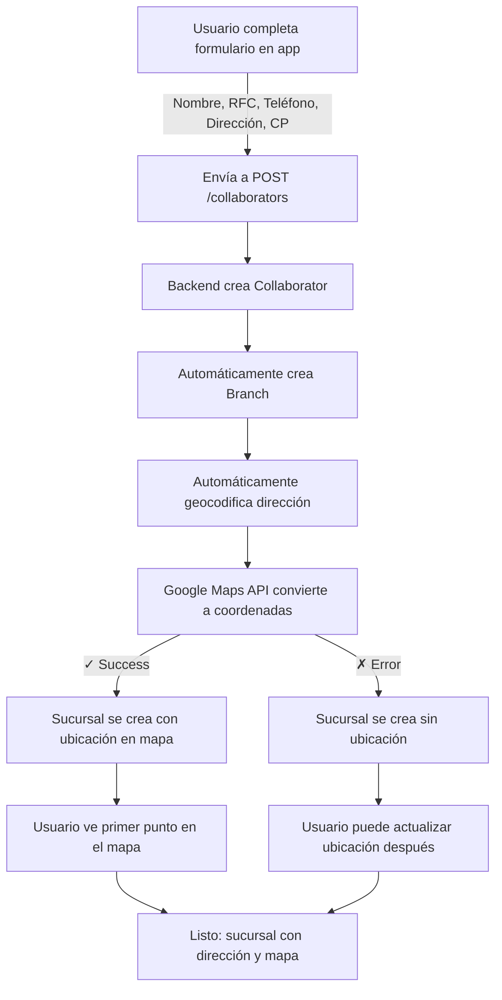

# Guía de Geocodificación - Beneficio Joven

## Resumen

Se ha implementado un sistema de **geocodificación automática** que convierte direcciones de texto en coordenadas geográficas usando la **Google Maps Geocoding API**. Esto permite:

1. ✅ **Crear automáticamente una primera sucursal** cuando un colaborador se registra
2. ✅ **Deducir coordenadas de mapas** a partir de direcciones de texto (ej: "Torre Eiffel" → París, Francia)
3. ✅ **Actualizar ubicaciones de sucursales** posteriormente con geocodificación

---

## Arquitectura Implementada

### Backend (NestJS + TypeScript)

#### 1. **GeocodingService** (`server-bj/src/common/geocoding.service.ts`)
- Integra Google Maps Geocoding API
- Convierte direcciones de texto a coordenadas (lat/lon)
- Valida coordenadas dentro de rangos válidos
- Maneja errores de API (rate limits, sin resultados, etc.)

**Métodos principales:**
```typescript
// Geocodificar una dirección
async geocodeAddress(address: string, components?: string): Promise<GeocodingResult>

// Geocodificar múltiples direcciones
async geocodeAddresses(addresses: string[], components?: string): Promise<GeocodingResult[]>

// Formatear coordenadas como "(longitude,latitude)" para PostgreSQL
formatCoordinatesForDatabase(coordinates: Coordinates): string
```

#### 2. **BranchService** (mejorado)
- Inyecta `GeocodingService` para geocodificación automática
- Nuevo método: `geocodeAndUpdateLocation(branchId, address, country?)`
- Formatea automáticamente coordenadas para la base de datos

#### 3. **CollaboratorsService** (mejorado)
- **Crea automáticamente una primera sucursal** al registrar un colaborador
- Usa datos del formulario: nombre del negocio, teléfono, dirección, código postal
- **Geocodifica automáticamente la dirección** para obtener coordenadas
- **Pone el punto en el mapa** si la geocodificación es exitosa
- Si falla, crea la sucursal sin ubicación (se puede actualizar después)

---

## Flujo de Registro de Colaborador



---

## Endpoints de Geocodificación

### 1. **Geocodificar y actualizar ubicación de sucursal**
```http
PATCH /branch/:id/geocode?address=Torre%20Eiffel&country=FR

Query Parameters:
  - address (requerido): La dirección a geocodificar
  - country (opcional): Código de país ISO (ej: "MX", "FR", "US")

Response:
{
  "branchId": 1,
  "name": "La Bella Italia",
  "address": "Av. Reforma 123",
  "phone": "5555551234",
  "zipCode": "06500",
  "location": "(-99.1234,25.6789)",  // Nuevo: coordenadas en formato PostgreSQL Point
  "state": "ACTIVE"
}
```

### 2. **Flujo automático: Crear colaborador con primera sucursal (con geocodificación automática)**
```http
POST /collaborators
Content-Type: application/json

{
  "businessName": "Pizzería La Bella Italia",
  "rfc": "PLB211225ABC",
  "representativeName": "Juan Pérez",
  "phone": "5555551234",
  "email": "juan@ejemplo.com",
  "address": "Av. Reforma 123, Colonia Juárez, CDMX",
  "postalCode": "06500",
  "cognitoId": "user-uuid-from-cognito",
  "state": "ACTIVE"
}

Response:
{
  // Colaborador creado
  "cognitoId": "user-uuid-from-cognito",
  "businessName": "Pizzería La Bella Italia",
  // ... resto de campos
}

// La sucursal se crea automáticamente CON geocodificación:
{
  "branchId": 1,
  "collaboratorId": "user-uuid-from-cognito",
  "name": "Pizzería La Bella Italia",
  "phone": "5555551234",
  "address": "Av. Reforma 123, Colonia Juárez, CDMX",
  "zipCode": "06500",
  "location": "(-99.1452, 19.4263)",  // ✓ Geocodificada automáticamente
  "formattedAddress": "Av. Paseo de la Reforma 123, Juárez, Cuauhtémoc...",  // Dirección completa
  "state": "ACTIVE"
}
```

**Proceso automático:**
1. Se recibe la dirección "Av. Reforma 123, Colonia Juárez, CDMX"
2. Se geocodifica con Google Maps API
3. Se obtienen coordenadas: `(-99.1452, 19.4263)`
4. Se guarda en la sucursal en formato: `(longitude, latitude)`
5. El mapa puede mostrar inmediatamente el punto

---

## Configuración

### Variables de Entorno Requeridas

Agregar a tu archivo `.env`:

```bash
# Google Maps Geocoding API
GOOGLE_MAPS_API_KEY=your_google_maps_api_key_here
```

### Obtener una API Key de Google Maps

1. Ir a [Google Cloud Console](https://console.cloud.google.com/)
2. Crear un nuevo proyecto
3. Habilitar la API: **Maps SDK for JavaScript**
4. Crear credenciales: **API Key**
5. Restringir a **IP de tu servidor** para seguridad
6. Copiar la clave a tu `.env`

### Validación de Configuración

Si `GOOGLE_MAPS_API_KEY` no está configurada:
- El servicio log un warning al iniciar
- Las peticiones de geocodificación fallarán con un error descriptivo
- El resto del sistema funciona normalmente (sin geocodificación)

---

## Ejemplos de Uso

### Ejemplo 1: Registrar colaborador y luego geocodificar

```bash
# 1. Registrar colaborador
curl -X POST http://localhost:3000/collaborators \
  -H "Content-Type: application/json" \
  -d '{
    "businessName": "Taquería El Chilango",
    "rfc": "TEC240101XYZ",
    "representativeName": "Pedro García",
    "phone": "5544332211",
    "email": "pedro@taqueria.com",
    "address": "Calle de los Plateros 42, Centro, CDMX",
    "postalCode": "06010",
    "cognitoId": "auth0|64f3c5e2b8c0d1e2f3g4h5i6",
    "state": "ACTIVE"
  }'

# Respuesta incluye el colaborador y sucursal creados
# branchId = 1

# 2. Geocodificar la dirección de la sucursal
curl -X PATCH "http://localhost:3000/branch/1/geocode?address=Calle%20de%20los%20Plateros%2042&country=MX"

# Respuesta:
# {
#   "branchId": 1,
#   "location": "(-99.1329, 19.4326)",  // Coordenadas de la dirección
#   "formattedAddress": "Calle de los Plateros 42, Centro, Cuauhtémoc..."
# }
```

### Ejemplo 2: Solo geocodificar una dirección (sin registrar colaborador)

```bash
curl -X PATCH "http://localhost:3000/branch/5/geocode?address=Torre%20Eiffel&country=FR"

# Google Maps interpretará que es la Torre Eiffel en Francia
# Response:
# {
#   "branchId": 5,
#   "location": "(2.2945, 48.8584)",  // Coordenadas reales de la Torre Eiffel
#   "formattedAddress": "5 Avenue Anatole France, 75007 Paris, France"
# }
```

### Ejemplo 3: Usar en la app móvil (después de crear sucursal)

```kotlin
// En BranchManagementScreen.kt o BranchLocationPicker.kt

suspend fun geocodifyBranchAddress(branchId: Int, address: String) {
    val service = RetrofitClient.getInstance().create(BranchApiService::class.java)
    val response = service.geocodifyBranchAddress(branchId, address, "MX")
    // Actualizar UI con las nuevas coordenadas
}
```

---

## Manejo de Errores

### Posibles errores:

| Error | Causa | Solución |
|-------|-------|----------|
| `ZERO_RESULTS` | Dirección no encontrada | Verificar ortografía, intentar dirección más específica |
| `OVER_QUERY_LIMIT` | Límite de API excedido | Esperar o aumentar cuota en Google Cloud |
| `REQUEST_DENIED` | API Key inválida/sin permisos | Verificar `.env`, permisos en Google Cloud |
| `INVALID_REQUEST` | Formato de solicitud incorrecto | Verificar que `address` esté URL-encoded |
| `Geocoding service is not configured` | Falta `GOOGLE_MAPS_API_KEY` | Agregar variable de entorno |

---

## Casos de Uso Prácticos

### 1. **Colaborador se registra con dirección física**
- Escribe: "Pizzería La Bella Italia, México"
- Sistema automáticamente crea primera sucursal
- Después puede ajustar ubicación con geocodificación

### 2. **Buscar colaboradores cercanos**
- La app móvil obtiene ubicación del usuario
- Busca colaboradores dentro de radio de 3km
- Usa coordenadas geocodificadas de las sucursales

### 3. **Actualizar ubicación en mapa**
- Colaborador va a "Gestión de Sucursales"
- Ingresa dirección (ej: "Av. Paseo de la Reforma 500")
- Sistema geocodifica automáticamente
- Mapa se actualiza con ubicación exacta

---

## Limitaciones y Consideraciones

### Limitaciones de Google Maps API:

- **Rate Limit Gratuito**: ~2,500 solicitudes/día
- **Versión Pagada**: Hasta 25,000/día ($0.005 por solicitud adicional)
- **Precisión**: Generalmente ±30 metros en zonas urbanas
- **Soporte**: No geocodifica direcciones muy genéricas (ej: solo "México")

### Mejores Prácticas:

1. ✅ Siempre especificar país cuando sea posible (`country=MX`)
2. ✅ Usar direcciones lo más completas posible
3. ✅ Almacenar resultados en caché para evitar llamadas duplicadas
4. ✅ Validar coordenadas dentro de rangos esperados
5. ❌ No geocodificar cada vez que el usuario escribe (throttle)

---

## Próximas Mejoras Sugeridas

1. **Caché de Geocodificación**: Guardar resultados para no re-geocodificar
2. **Validación en Frontend**: Mostrar sugerencias mientras el usuario escribe (Google Places API)
3. **Reversa Geocodificación**: Convertir coordenadas → dirección texto
4. **Monitoreo de cuota**: Alertar cuando se acerque al límite de API
5. **Manejo por país**: Diferentes comportamientos para MX, US, FR, etc.

---

## Resumen de Cambios

### Backend:
- ✅ `GeocodingService` - Nuevo servicio de geocodificación
- ✅ `CommonModule` - Nuevo módulo con servicios comunes
- ✅ `BranchService.geocodeAndUpdateLocation()` - Nuevo método para geocodificación manual
- ✅ `CollaboratorsService.create()` - Ahora crea sucursal Y geocodifica automáticamente
- ✅ `BranchController` - Nuevo endpoint `/branch/:id/geocode` para geocodificación manual
- ✅ `CollaboratorsModule` - Importa CommonModule para acceso a GeocodingService

### Mobile App:
- ℹ️ No hay cambios requeridos (usa endpoints existentes)
- 💡 Sugerencia: Integrar Google Places API para autocompletar direcciones
- 📍 **Mejora:** Mostrar el mapa con el punto cuando el usuario vea la primera sucursal

---

## Preguntas Frecuentes

**P: ¿Se geocodifica automáticamente al registrar?**
R: ✅ SÍ, ahora se geocodifica automáticamente. Se crea la sucursal CON las coordenadas en el mapa.

**P: ¿Puedo editar manualmente las coordenadas?**
R: Sí, via `PATCH /branch/:id` con field `location` en formato `(lon,lat)`.

**P: ¿Qué pasa si la geocodificación falla al registrar?**
R: La sucursal se crea SIN ubicación. El sistema continúa normalmente. Luego el usuario puede usar el endpoint `/branch/:id/geocode` para actualizar la ubicación manualmente.

**P: ¿Es gratis?**
R: Google Maps ofrece 2,500 llamadas/mes gratis. Después es $0.005/llamada.

---

Implementado por: Claude AI
Fecha: 2025-10-21
